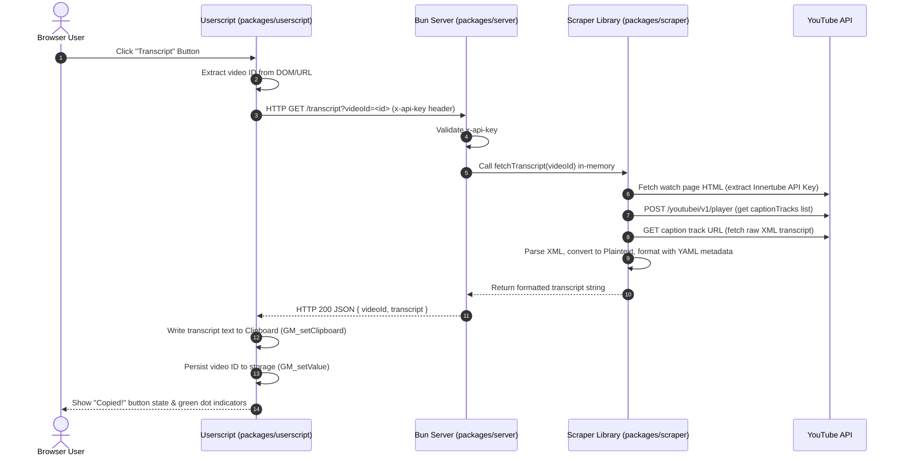
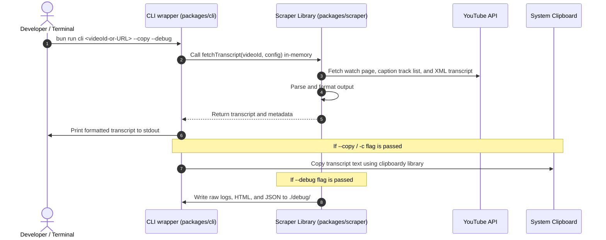

# YouTube Transcript Monorepo

A lightweight Bun workspace monorepo for downloading YouTube transcripts.

## Why this exists

YouTube strictly rate-limits or blocks non-residential IP addresses (like those of Cloudflare Workers, AWS, or other cloud edge hosting). To reliably download transcripts, this project uses a client-side architecture:
1. **Userscript**: Runs in the browser and injects a "Transcript" button on YouTube videos.
2. **Local HTTP Server**: A background process listening on `localhost:3456`. When you click the userscript button, it sends the video ID to this server, which scrapes the transcript using your residential IP address and returns it.

---

## Package Directory Layout

* **`packages/scraper`**: Core library that contacts YouTube's Innertube API, fetches the caption track, and parses it (zero build step in local development).
* **`packages/server`**: Background HTTP API server that loads the scraper directly in-memory (no subprocess spawning).
* **`packages/userscript`**: Browser userscript built using Vite and `vite-plugin-monkey`.
* **`packages/cli`**: Command-line interfaces, tests, and debugging scripts.

---

## Getting Started

### 1. Install Dependencies
Run from the root directory:
```bash
bun install
```

### 2. Configure Environment Variables
Copy `.env.example` to `.env` in the root directory:
```bash
cp .env.example .env
```
*(Optionally define a `SERVER_API_KEY` for authenticating calls between the userscript and the server. If configured, you should also create `packages/userscript/.env` containing `VITE_TRANSCRIPT_API_KEY=your_key`)*

---

## Development & Utility Commands

Execute these commands from the root directory:

### Running the Server & Userscript
* **Start local server (with hot reload):**
  ```bash
  bun run dev:server
  ```
* **Build userscript:**
  ```bash
  bun run build:userscript
  ```
  *(Produces output inside `packages/userscript/dist/youtube-copy-transcript.user.js` for installation in Tampermonkey/Violentmonkey)*

### Using CLI & Inspection Tools
* **Run CLI to print transcript:**
  ```bash
  bun run cli <videoId-or-URL>
  ```
* **Inspect raw Innertube player response (for debugging):**
  ```bash
  bun run inspect <videoId>
  ```

### Code Quality & Formatting
* **Run unit tests:**
  ```bash
  bun run test
  ```
* **Run workspace typechecks:**
  ```bash
  bun run typecheck
  ```
* **Format & Lint code (handled automatically on commit via Lefthook):**
  ```bash
  bun run format
  bun run lint
  ```

---

## Data Flow & Workflows

### 1. Normal Workflow (Browser Userscript + Local Server)

This is the standard workflow when browsing YouTube. The transcript is fetched via the local server using your home IP and copied to your browser's clipboard automatically.



* **Who fetches the transcript?** The `@youtube-transcript/scraper` library (embedded in `@youtube-transcript/server`) coordinates the requests to YouTube.
* **Who copies to the clipboard?** The browser-level userscript processes the returned text and writes it to your system clipboard using Tampermonkey's `GM_setClipboard`.
* **Who persists the state?** The userscript saves the copied video ID locally via Tampermonkey storage so that the button can reflect a "previously copied" indicator (a green dot) if you revisit the page.

---

### 2. Alternative Workflow (Command-Line Interface / CLI)

This is the developer workflow. You run the scraping pipeline directly in your terminal, and can optionally output transcripts, save debug files, or copy to the clipboard.



* **Who fetches the transcript?** The `@youtube-transcript/scraper` library (imported by `@youtube-transcript/cli`).
* **Who copies to the clipboard?** The `@youtube-transcript/cli` package, utilizing the `clipboardy` library to interface with your OS clipboard.
* **Who writes debug files?** The `@youtube-transcript/scraper` debug handler writes intermediate HTTP responses to a local `./debug` directory if the `--debug` flag is passed.

